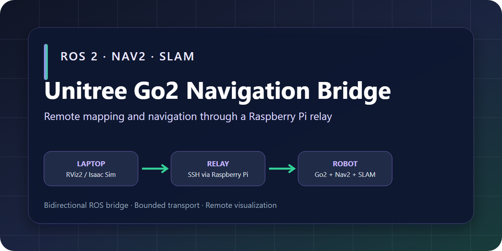
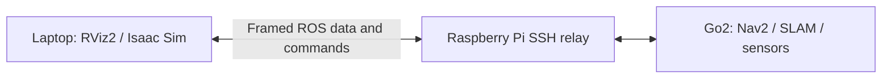

# Unitree Go2 Navigation Bridge

<p align="center">
  
</p>

[](https://github.com/nortiz01/indoor-inspection-robot/actions/workflows/ci.yml)

ROS 2 tooling for running navigation on a Unitree Go2 while monitoring and commanding it from a laptop through a Raspberry Pi relay. It is the mobility, mapping, and visualization subsystem of an indoor-inspection platform; inspection sensing and defect reporting are outside this repository's current scope.

The project supports two hardware workflows:

- **Live mapping:** runs SLAM Toolbox, Nav2, Go2 base bringup, point-cloud processing, and the laptop visualization bridge.
- **Saved-map navigation:** runs AMCL localization and Nav2 against the included room map.

RViz2 is the primary operator interface. An optional Isaac Sim viewer mirrors the relayed map, pose, scan, and point cloud, but it does not simulate or control the robot.

> [!IMPORTANT]
> This is a hardware-specific robotics project, not a plug-and-play simulator. The scripts assume the ROS workspaces, network interfaces, and remote project paths described below. Verify those assumptions before operating a robot.

## Engineering Highlights

- Runs Nav2 and SLAM close to the robot while exposing a focused operator view on the laptop.
- Carries selected ROS messages across an SSH-routed network without relying on DDS discovery through the relay.
- Uses bounded transport and asynchronous sending so high-bandwidth visualization data cannot indefinitely block ROS callbacks.
- Supports saved-map navigation, live mapping, RViz2, and an optional Isaac Sim visualization path.
- Includes hardware-independent protocol, configuration, script, and asset validation while keeping robot testing requirements explicit.

## Architecture

The detailed data-flow and trust-boundary diagram is available in [`docs/ARCHITECTURE.md`](docs/ARCHITECTURE.md).



Direct ROS 2 discovery can be unreliable across the Pi relay and hotspot route, so this project transports selected serialized ROS messages over two TCP channels inside SSH tunnels:

- port `16000`: Go2 navigation data to the laptop
- port `16001`: laptop pose and goal commands to the Go2

The Go2-side bridge relays visualization topics and converts RViz goal poses into Nav2 `NavigateToPose` actions. The laptop-side receiver republishes those topics into the local ROS graph.

## What Is Included

- Launch files for live SLAM and static-map Nav2 workflows
- A two-way ROS-to-TCP bridge designed for SSH forwarding
- Laptop launch helpers for RViz2 and Isaac Sim
- A saved occupancy map and tuned Nav2/SLAM parameters
- A Go2 URDF, meshes, and joint-state TF publisher for visualization
- Optional front-camera relay with conservative bandwidth defaults
- Raspberry Pi host discovery using mDNS/DNS or a previously trusted SSH host key

## Repository Layout

| Path | Purpose |
| --- | --- |
| `config/bridge.env.example` | Template for laptop, Pi, Go2, tunnel, and relay settings |
| `scripts/` | Laptop-side install, tunnel, receiver, and viewer launch helpers |
| `scripts/lib/bridge_env.sh` | Shared configuration loading and Pi discovery logic |
| `go2_navigation/` | ROS 2 package containing launch files, parameters, maps, and bridge nodes |
| `go2_scripts/` | Entry points installed on the Go2 |
| `rviz/` | RViz2 display configuration |
| `isaac/` | Optional Isaac Sim visualization client |
| `robot_description/` | Go2 URDF, meshes, and the assets' upstream license |
| `third_party/licenses/` | License notices for adapted upstream software |
| `THIRD_PARTY_NOTICES.md` | Dependency credits and third-party asset provenance |

## Requirements and Assumptions

### Laptop

- Ubuntu or another Linux environment with Bash
- ROS 2 Humble or Foxy; the laptop scripts prefer Humble when both are installed
- RViz2 and the ROS message packages imported by `scripts/laptop_rviz_receiver.py`
- Python 3, OpenSSH (`ssh` and `scp`), `tar`, and standard Unix utilities
- SSH access to the Pi and a route from the Pi to the Go2
- Optional: Isaac Sim 4.5 using its bundled ROS 2 Humble bridge layout

### Raspberry Pi relay

- SSH server reachable from the laptop
- Network access to the Go2, normally over the robot-side wired network
- No project files need to be installed on the Pi; it acts as the SSH jump host

### Unitree Go2

- ROS 2 Foxy at `/opt/ros/foxy/setup.bash`
- Unitree Cyclone DDS workspace at `~/unitree_ros2/cyclonedds_ws/install/setup.bash`
- Packages providing `go2_core`, `go2_perception`, `unitree_go`, `nav2_bringup`, `slam_toolbox`, and `tf2_ros`
- `colcon` for building the installed `go2_navigation` package
- Optional camera support: Python GObject bindings and GStreamer plugins for RTP/H.264 decoding

The deployment scripts intentionally use `/home/unitree/go2_navigation_project` on the Go2. The launch files also assume the robot network interface is `eth0`. Change the scripts or pass the relevant launch argument if your robot differs.

## Setup

### 1. Clone the repository

```bash
git clone https://github.com/nortiz01/indoor-inspection-robot.git
cd indoor-inspection-robot
```

Git preserves the executable bits on the shell and Python entry points. If you downloaded a source archive instead, restore them with:

```bash
chmod +x scripts/*.sh scripts/*.py go2_scripts/*.sh go2_navigation/go2_navigation/*.py isaac/*.py
```

### 2. Create a local network configuration

```bash
cp config/bridge.env.example config/bridge.env
${EDITOR:-nano} config/bridge.env
```

At minimum, review these values:

| Variable | Meaning | Template default |
| --- | --- | --- |
| `PI_HOST` | Pi address, resolvable hostname, or `auto` | `auto` |
| `PI_USER` | SSH user on the Pi | `user` |
| `GO2_HOST` | Go2 address on the robot-side network | `192.168.123.18` |
| `GO2_USER` | SSH user on the Go2 | `unitree` |

`config/bridge.env` is ignored by Git. Keep passwords, private keys, and site-specific credentials out of this file; SSH handles authentication separately.

#### Pi discovery

With `PI_HOST=auto`, the scripts try the hostnames in `PI_MDNS_HOSTS`. If the laptop has connected to the Pi before, you can also supply one or more previous addresses whose saved SSH host keys identify it:

```bash
PI_HOST=auto
PI_MDNS_HOSTS="raspberrypi.local pi.local raspi.local"
PI_KNOWN_HOSTS="<previous-pi-ip>"
```

With a fixed `PI_HOST` and `PI_HOST_AUTO_REFRESH=true`, a stale address can be replaced by scanning the laptop's active `/24` networks and matching the Pi's previously trusted SSH host key. The scan requires `ssh-keygen` and `ssh-keyscan`; hostname discovery may use `getent`, Avahi, or `host` when available.

Confirm SSH host fingerprints the first time each host is reached. The scripts use `StrictHostKeyChecking=accept-new`, which trusts a new host key but rejects a changed one.

### 3. Install the project on the Go2

```bash
./scripts/install_go2_project.sh
```

The installer:

1. archives `go2_navigation/` and `go2_scripts/` locally;
2. copies the archive to the Go2 through the Pi;
3. extracts and builds a uniquely named staging workspace;
4. validates the package, executables, and launch arguments before activation; and
5. switches the verified workspace into place with same-filesystem renames while retaining the replaced version at `/home/unitree/go2_navigation_project.previous`.

If staging or activation fails, the installer keeps or restores the last working deployment. The project owns `/home/unitree/go2_navigation_project` and its `.previous` rollback directory; keep unrelated packages outside them.

## Run the Project

Use three laptop terminals. Start only one Go2 navigation mode at a time.

### Terminal 1: open the SSH tunnels

```bash
cd indoor-inspection-robot
./scripts/start_tunnels.sh
```

Leave this process running. Stop it later with `Ctrl+C`; `scripts/stop_tunnels.sh` is a reminder helper and does not terminate another process.

### Terminal 2: start the laptop receiver and RViz2

```bash
cd indoor-inspection-robot
./scripts/start_laptop_rviz.sh
```

This starts the TCP receiver, publishes the local Go2 URDF and fixed transforms, and opens RViz2 with `rviz/go2_navigation.rviz`. Runtime logs are written under the ignored `logs/` directory.

`scripts/start_all_laptop.sh` is a convenience alias for this step; it still expects the tunnel to be running in another terminal.

### Terminal 3A: live mapping

```bash
cd indoor-inspection-robot
./scripts/start_go2_live_mapping_over_ssh.sh
```

This starts Go2 base and perception packages, online asynchronous SLAM Toolbox, Nav2, joint TF publishing, and the TCP bridge.

### Terminal 3B: saved-map navigation

```bash
cd indoor-inspection-robot
./scripts/start_go2_nav_over_ssh.sh
```

This starts AMCL and Nav2 with `go2_navigation/maps/room_map_toolbox.yaml`. The launch file publishes a saved initial pose and cycles the map server automatically. That map and pose are environment-specific: set a new pose in RViz before sending a goal whenever the robot is not starting at the recorded location.

### Optional: use the Isaac Sim viewer

Use this in terminal 2 instead of `start_laptop_rviz.sh`:

```bash
export ISAACSIM_ROOT="$HOME/isaacsim"
./scripts/start_laptop_isaacsim.sh
```

If Isaac Sim's ROS bridge is installed elsewhere, also set `ISAAC_ROS_BRIDGE_ROOT`. Extra viewer arguments are passed through, for example:

```bash
./scripts/start_laptop_isaacsim.sh --headless --max-cloud-points 6000
```

The Isaac viewer shows a lightweight robot marker, map, scan, point cloud, odometry/TF pose, and the latest initial/goal pose markers. It does not import the articulated Go2 model, provide RViz click tools, run Nav2, or control the robot.

## Configuration Reference

The checked-in template documents every setting. The most commonly tuned options are:

| Variable | Purpose | Default |
| --- | --- | --- |
| `GO2_CAMERA_ENABLE` | Start the project camera publisher | `false` |
| `LAPTOP_ROS_LOCALHOST_ONLY` | Keep laptop ROS discovery and command topics on loopback | `1` |
| `GO2_CAMERA_FPS` | Camera capture target | `5` |
| `GO2_JOINT_TF_ENABLE` | Publish leg TF from Unitree LowState | `true` |
| `GO2_LOWSTATE_TOPICS` | Comma-separated LowState candidates | `lowstate,lf/lowstate` |
| `GO2_JOINT_TF_HZ` | Joint TF publish limit | `20.0` |
| `GO2_RVIZ_PROTOCOL` | Bridge encoding: versioned `binary` or rollout-only `legacy-json` | `binary` |
| `GO2_RVIZ_TOPIC_ALLOWLIST` | `default`, `all`, or a comma-separated topic set | `default` |
| `GO2_RVIZ_TOPIC_RATE_LIMITS` | Optional `/topic=hz` overrides | empty |
| `GO2_RVIZ_TF_MAX_HZ` | Relayed `/tf` rate limit | `20.0` |
| `GO2_RVIZ_IMAGE_MAX_HZ` | Relayed camera rate limit; `0` means unlimited | `2.0` |
| `GO2_RVIZ_POINTCLOUD_MAX_HZ` | Relayed `/trans_cloud` rate limit | `0.5` |
| `GO2_RVIZ_QUEUE_CAPACITY` | Maximum queued topics/samples before replacement or drop | `32` |
| `GO2_RVIZ_MAX_FRAME_BYTES` | Maximum accepted framed message size | `16777216` |
| `GO2_RVIZ_MAX_BUFFER_BYTES` | Maximum incomplete receive-buffer size | `20971520` |
| `GO2_RVIZ_WRITE_TIMEOUT` | Network write timeout in seconds | `2.0` |
| `GO2_COMMAND_MAX_AGE` | Maximum time a command may wait in the laptop outbound queue | `5.0` |
| `ENABLE_GO2_MODEL` | Publish the laptop-side URDF and fixed TF | `true` |
| `GO2_URDF` | Optional alternate local URDF path | repository URDF |

The default topic profile excludes high-bandwidth global and local costmaps. Set `GO2_RVIZ_TOPIC_ALLOWLIST=all`, enable `GO2_RVIZ_DEBUG_ALL_TOPICS=true`, or provide an explicit topic list only while those streams are needed. The legacy JSON transport exists for coordinated rollout compatibility; use the binary protocol once both endpoints are updated.

The legacy `go2_core` video path remains disabled because some Go2 installations do not include `video_stream_node.py`. This project uses its own camera publisher when `GO2_CAMERA_ENABLE=true`.

## Relayed ROS Data

| Display or function | Topic/source | Message type | Notes |
| --- | --- | --- | --- |
| Map | `/map` | `nav_msgs/OccupancyGrid` | Live SLAM or saved map |
| Robot model | `/robot_description` | `std_msgs/String` | Published on the laptop from the included URDF |
| Transforms | `/tf`, `/tf_static` | `tf2_msgs/TFMessage` | Robot TF plus laptop-side fixed model TF |
| Laser scan | `/scan` | `sensor_msgs/LaserScan` | Used by localization and Nav2 |
| Point cloud | `/trans_cloud` | `sensor_msgs/PointCloud2` | Accumulated Go2 point cloud |
| Camera | `/camera/image_raw` | `sensor_msgs/Image` | Disabled by default to protect bridge bandwidth |
| Odometry | `/odom` | `nav_msgs/Odometry` | Available but disabled by default in RViz |
| Plans | `/plan`, `/local_plan` | `nav_msgs/Path` | Relayed when published by the stack |
| Costmaps | global and local costmap topics | `nav_msgs/OccupancyGrid` | Opt-in through the `all`/debug or explicit allowlist profile |
| Operator commands | `/initialpose`, `/goal_pose` | geometry messages | Forwarded from the laptop to the Go2 |

Use `map` as the RViz fixed frame. Before sending a goal, confirm that `map`, `odom`, `base_link`, and `base_footprint` are connected in TF and that `/scan`, `/odom`, and the costmaps are updating.

## Safety and Security

- Test in a clear, controlled area with an operator ready to stop the robot.
- Confirm localization, footprint, costmaps, and the physical starting pose before enabling movement.
- The included map, initial pose, and navigation tuning were captured for a specific indoor environment. Re-map and retune before using them elsewhere.
- Run either live mapping or saved-map localization, never both at the same time.
- Camera and point-cloud traffic can saturate a Pi or hotspot connection. Increase relay rates gradually while watching command latency.
- The versioned bridge protocol enforces frame and buffer limits but has no authentication or encryption of its own. Keep its endpoints on loopback as configured and carry it only through the SSH tunnels.
- Laptop ROS discovery defaults to loopback so another DDS participant on the LAN cannot publish navigation commands into this bridge. Set `LAPTOP_ROS_LOCALHOST_ONLY=0` only for a trusted, isolated ROS network or an authenticated SROS2 deployment.
- Do not expose ports `16000` or `16001` on an untrusted network.

## Troubleshooting

### `Missing config/bridge.env`

```bash
cp config/bridge.env.example config/bridge.env
${EDITOR:-nano} config/bridge.env
```

### SSH cannot reach the Go2

Test the hops separately after loading the local configuration. Set `PI_TEST_HOST` to the Pi's current address or resolvable hostname, even when the project uses automatic discovery:

```bash
source config/bridge.env
PI_TEST_HOST=raspberrypi.local
ssh "${PI_USER}@${PI_TEST_HOST}"
ssh -J "${PI_USER}@${PI_TEST_HOST}" "${GO2_USER}@${GO2_HOST}"
```

If `PI_HOST=auto`, test the resolved mDNS/DNS name directly or temporarily set the current address. Automatic key-based discovery works only when the Pi already has an entry in `~/.ssh/known_hosts`.

### `connect_to 127.0.0.1 port 16000: failed`

The reverse tunnel is active before the laptop receiver is listening. Start `./scripts/start_laptop_rviz.sh`; the warning should stop when the receiver accepts the connection.

### RViz reports missing `map` or TF data

Confirm all three terminals are still running. In saved-map mode, AMCL needs a valid initial pose before it publishes `map -> odom`. In live mode, wait for SLAM Toolbox to publish that transform. Do not send goals until the TF tree is complete.

The Go2 bridge periodically prints status similar to:

```text
data=connected, commands=waiting, relayed: /tf=...
```

### The robot model is missing or its legs do not move

Check the laptop logs under `logs/` and verify the default URDF exists at `robot_description/go2/urdf/go2.urdf`. For an alternate model, set `GO2_URDF` in `config/bridge.env`.

If the body appears but the legs remain neutral, inspect the Go2 terminal for `Using LowState topic for joint TF`. Find the correct topic with:

```bash
ros2 topic list | grep lowstate
```

Then update `GO2_LOWSTATE_TOPICS`.

### The camera is missing or makes RViz lag

The camera is off by default. Enable it explicitly and restart the Go2 mode:

```bash
GO2_CAMERA_ENABLE=true
GO2_RVIZ_IMAGE_MAX_HZ=2.0
```

If the stream is still absent, inspect the Go2 output for GStreamer errors and verify its RTP/H.264 plugins. If commands or RViz become sluggish, disable the camera or lower both the capture and relay rates.

### The point cloud is missing or saturates the link

The RViz config uses `/trans_cloud`. Confirm the Go2 perception stack is publishing that topic and check the bridge status. To reduce bandwidth further, use a lower positive limit, for example:

```bash
GO2_RVIZ_POINTCLOUD_MAX_HZ=0.25
```

### Goals appear in RViz but the robot does not move

Verify the command channel on port `16001`, confirm that the `navigate_to_pose` action server is available on the Go2, and check that Nav2 lifecycle nodes are active.

### `AMENT_TRACE_SETUP_FILES: unbound variable`

ROS setup files may reference unset variables. Source ROS and workspace setup files before enabling `set -u`, as the included Go2 wrappers do.

### Persistent `EmptyFrameID` or transform timeout warnings

Verify that the perception stack publishes a valid frame on `/scan` and `/trans_cloud`, then confirm the corresponding transform chain. Brief startup warnings can be normal; persistent warnings indicate missing or mistimed TF data.

## Development Checks

The automated suite covers protocol framing and fragmentation, bounded queues, rate limiting, transform utilities, point-cloud conversion, configuration assets, and documentation without requiring ROS or robot hardware:

```bash
python3 -m pip install "numpy<2" PyYAML pytest
python3 -m compileall -q scripts go2_navigation isaac tests tools
python3 tools/validation/validate_repository.py
python3 -m pytest -q tests
find scripts go2_scripts -name '*.sh' -print0 | xargs -0 -n1 bash -n
find scripts go2_scripts -name '*.sh' -print0 | xargs -0 shellcheck --severity=error
```

On a configured ROS 2 system, build the package with:

```bash
colcon build --packages-select go2_navigation
```

Hardware validation should cover both navigation modes, tunnel reconnection, TF completeness, initial-pose handling, goal forwarding, and emergency-stop behavior.

## License and Third-Party Software

No repository-wide license has been declared for the project-owned code. Derived portions of `go2_navigation/` and the Go2 visualization assets retain their respective upstream MIT notices. Dependency credits, file-level provenance, and license locations are documented in [THIRD_PARTY_NOTICES.md](THIRD_PARTY_NOTICES.md).

Before redistributing or reusing the project-owned code, add or obtain an explicit license from the repository owner and continue to honor all third-party notices.
