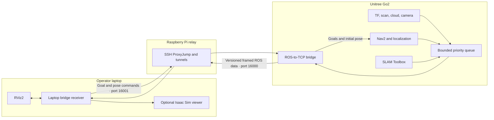

# Architecture

Navigation runs on the Go2, while the laptop provides operator visualization and goal input. A Raspberry Pi acts only as an SSH jump host between the laptop network and the robot network. Laptop ROS discovery is loopback-only by default, so commands originate from the local operator tools rather than arbitrary DDS peers on the LAN.

## Data flow

- High-rate robot topics enter a bounded sender so a slow tunnel cannot block ROS callbacks indefinitely.
- The bridge rate-limits configured topics and retains current samples instead of building an unbounded backlog.
- Serialized ROS payloads use explicit framing and size limits across the SSH tunnel.
- The laptop republishes supported message types into its local ROS graph for RViz2 or the optional Isaac Sim viewer.
- RViz goal and initial-pose messages travel over a separate return channel to the Go2 bridge and Nav2.

The bridge is not a substitute for localization or motion safety. Navigation remains dependent on valid TF, synchronized timestamps, correct footprint parameters, obstacle data, and supervised hardware operation.
